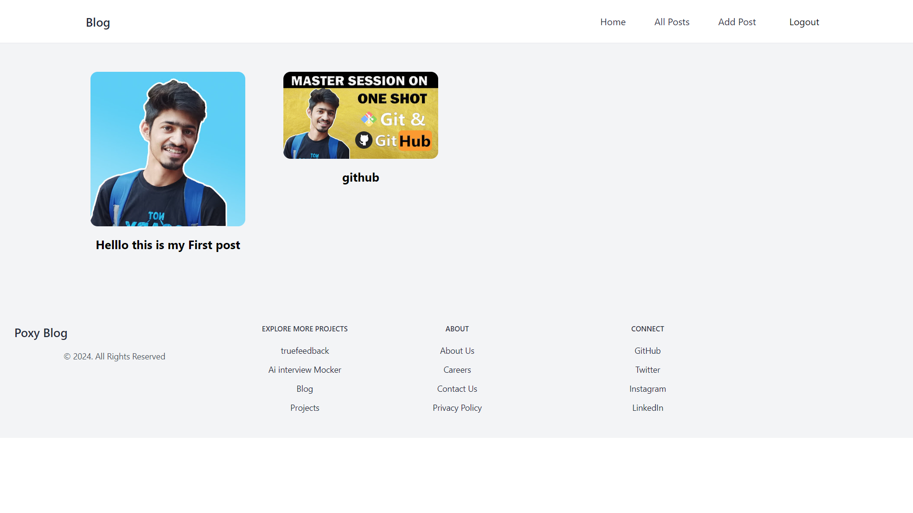
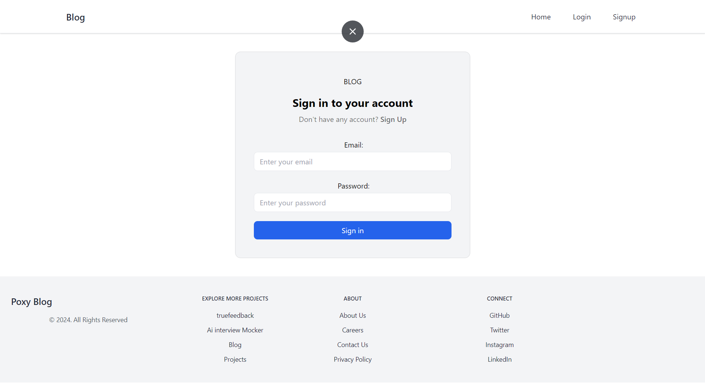

# Blog App with Appwrite Backend

Welcome to the Blog App! This project is a simple blogging platform built using the Appwrite backend. It allows users to create, read, update, and delete blog posts.

# UI DEMO





## Table of Contents

- [Features](#features)
- [Tech Stack](#tech-stack)
- [Getting Started](#getting-started)
- [Installation](#installation)
- [Configuration](#configuration)
- [Usage](#usage)
- [Contributing](#contributing)
- [License](#license)

## Features

- User authentication and authorization
- Create, read, update, and delete blog posts
- Rich text editor for writing posts
- Commenting system
- Responsive design

## Tech Stack

- Frontend: HTML, CSS, JavaScript, React (optional)
- Backend: Appwrite
- Database: Appwrite Database
- Authentication: Appwrite Auth

## Getting Started

To get a local copy up and running follow these simple steps.

### Prerequisites

- Node.js and npm installed on your machine
- Appwrite server setup (refer to the [Appwrite Documentation](https://appwrite.io/docs) for installation and setup)

### Installation

1. Clone the repository:
    ```sh
    git clone https://github.com/Prabal-verma/appwriteBlogApp.git
    ```

2. Navigate to the project directory:
    ```sh
    cd appwriteBlogApp
    ```

3. Install the dependencies:
    ```sh
    npm install
    ```

### Configuration

1. Set up your Appwrite project:
    - Create a new project in your Appwrite console.
    - Create a new database in your project.
    - Create collections for users, posts, and comments with appropriate attributes.

2. Create a `.env` file in the root of your project and add your Appwrite configuration:
    ```env
    REACT_APP_APPWRITE_ENDPOINT=https://YOUR_APPWRITE_ENDPOINT/v1
    REACT_APP_PROJECT_ID=YOUR_PROJECT_ID
    ```

### Usage

1. Start the development server:
    ```sh
    npm start
    ```

2. Open your browser and navigate to `http://localhost:3000`.

## Contributing

Contributions are what make the open source community such an amazing place to learn, inspire, and create. Any contributions you make are **greatly appreciated**.

1. Fork the Project
2. Create your Feature Branch (`git checkout -b feature/AmazingFeature`)
3. Commit your Changes (`git commit -m 'Add some AmazingFeature'`)
4. Push to the Branch (`git push origin feature/AmazingFeature`)
5. Open a Pull Request

## License

Distributed under the MIT License. See `LICENSE` for more information.
